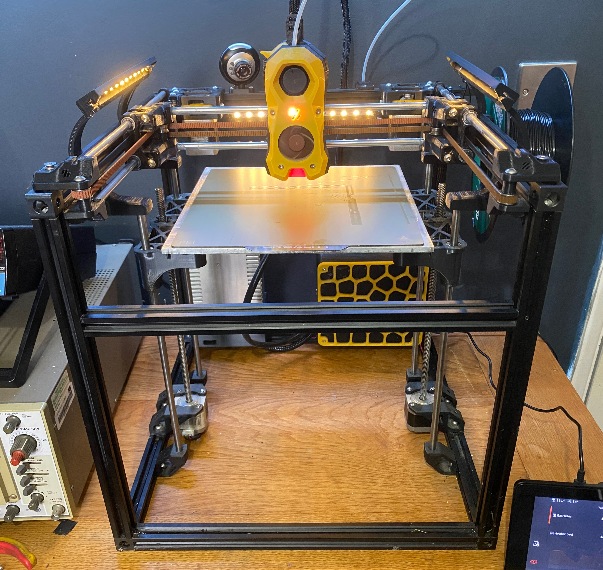

# voron-legacy-mods

A collection of small Mods made for my Voron Legacy

## Rear cover for StealthBurner
I really liked the cover that the stock Afterburner had on the rear to hide all the cables, so I made one for the SB

## Raised Lights
I liked this LED Strip Holder I found on Printables: https://www.printables.com/model/84735-led-strip-holder-for-voron-24
But the Z axis mounts stop you from mounting them on the sides. So I made some arms to raise them up.

## RAMPS Box
A box for RAMPS1.4, an external MOSFET and an 80mm fan

## Vertical Bowden Holder
Used in conjunction with the Bowden Tube Holder from the Trident assembly to hold the bowden tube next to the umbilical.

## Umbilical Mount
A quick and easy way to mount the umbilical to the rear extrusion

## Corner Brace
I found that the rear extrusion could twist. On the Voron 1.5 the motor mounts stopped this happening, but not on the Legacy, this is a quick brace which bolts to the rear extrusion and the uprights

## C016 Webcam Mount
A mount for the tecknet C016 webcam

